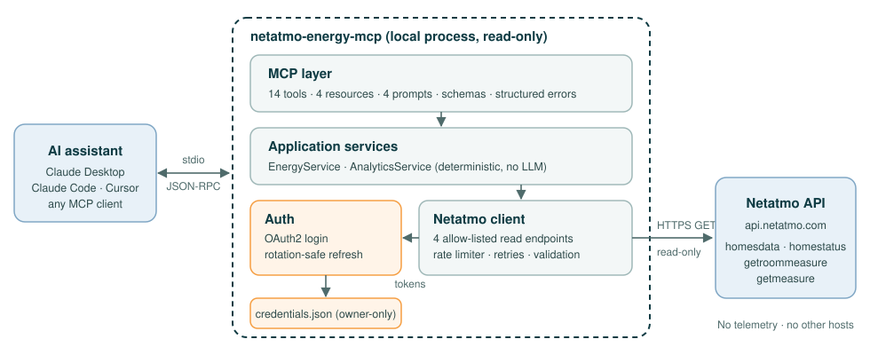

# Netatmo Energy MCP

[English](README.md) | **Français**

[](https://github.com/christophe77/netatmo-energy-mcp/actions/workflows/ci.yml)
[](LICENSE)


Un **serveur MCP Netatmo** en lecture seule pour les **thermostats
intelligents et vannes thermostatiques Netatmo**. Il donne à Claude,
Cursor et aux autres clients [Model Context Protocol](https://modelcontextprotocol.io)
un accès structuré à votre chauffage :

- températures et consignes des pièces
- demande de chauffe et activité de la chaudière
- historique des températures
- analyses de chauffage déterministes

Il tourne sur votre machine, ne communique qu'avec l'**API Netatmo Energy**
officielle et ne peut modifier aucun réglage de chauffage.

> **État : pré-version.** La version 0.1.0 est en préparation. Tant
> qu'elle n'est pas publiée sur npm, installez depuis les sources (voir
> [Démarrage rapide](#démarrage-rapide)).

## Pourquoi ce projet ?

Une installation de chauffage Netatmo enregistre des données utiles :

- la température et la consigne de chaque pièce
- ce que demande chaque vanne
- les moments où la chaudière est sollicitée

Ces données restent dans l'application Netatmo, où l'on peut les
consulter, mais pas leur poser de questions.

Ce projet est une petite passerelle entre l'API Netatmo Energy et
n'importe quel assistant IA compatible MCP. Posez une question simple :
« Quelle pièce était la plus froide cette nuit ? » L'assistant appelle un
outil précis, en lecture seule, et répond à partir de vos données. Il ne
devine pas.

Les rares autres serveurs MCP Netatmo visent les **stations météo**.
Celui-ci est conçu pour les **thermostats, vannes thermostatiques et
l'historique de chauffage**. Voir [docs/research.md](docs/research.md)
(en anglais).

## Fonctionnalités

- **Découverte :** logements, pièces, thermostats, vannes thermostatiques,
  relais et passerelles.
- **État actuel**
  - Par pièce : température, consigne, mode de consigne et demande de
    chauffe.
  - Chaudière en marche ou à l'arrêt, détection de fenêtre ouverte.
  - État des équipements : piles, signal radio/Wi-Fi, joignabilité.
- **Historique**
  - Température et consigne des pièces, avec une résolution de 30 min
    à 1 mois.
  - Activité de la chaudière (installations avec thermostat Netatmo).
  - Les longues périodes sont récupérées par morceaux et résumées, pour
    garder des réponses courtes.
  - Les trous de données sont signalés, jamais comblés.
- **Analyses de chauffage.** Ce sont des calculs déterministes ; aucun
  modèle d'IA ne calcule les chiffres.
  - Statistiques par pièce.
  - Temps sous, dans ou au-dessus de la consigne.
  - Plus forte baisse de température et vitesse de refroidissement.
  - Classement des pièces.
  - Détection par règles des relevés inhabituels, chacun avec sévérité
    et niveau de confiance.
- **14 outils MCP, 4 ressources et 4 prompts** (rapport quotidien, revue
  des anomalies, comparaison des pièces, revue des habitudes de chauffage).
- **Mise en place simple**
  - Connexion OAuth2 dans le navigateur avec une seule commande `login`.
  - Jetons stockés de façon sécurisée et renouvelés automatiquement.
  - `doctor` vérifie votre configuration.

## Démarrage rapide

Il faut Node.js 22.19 ou plus récent et un compte Netatmo avec des
équipements Energy.

### 1. Créer une application développeur Netatmo (gratuite)

1. Sur <https://dev.netatmo.com/apps>, choisissez **Create**.
2. Indiquez l'**URI de redirection** `http://localhost:8977/callback`.
3. Notez le **client ID** et le **client secret** pour l'étape 2.

Guide détaillé (en anglais) : [docs/authentication.md](docs/authentication.md).

### 2. Se connecter

```bash
npx -y netatmo-energy-mcp login
```

`login` demande le client ID et le secret, puis ouvre votre navigateur :
vous vous connectez sur netatmo.com et autorisez un accès **en lecture
seule**. Vérifiez ensuite la configuration :

```bash
npx -y netatmo-energy-mcp doctor
```

> **Avant la publication de la 0.1.0 sur npm :** clonez le dépôt, lancez
> `pnpm install && pnpm build`, puis remplacez `npx -y netatmo-energy-mcp`
> par `node /chemin/vers/netatmo-energy-mcp/dist/index.js` partout dans
> ce document.

### 3. Connecter votre client MCP

**Claude Code**

```bash
claude mcp add --transport stdio --scope user netatmo-energy -- npx -y netatmo-energy-mcp
```

**Claude Desktop.** Modifiez `claude_desktop_config.json` (Réglages →
Développeur → Modifier la configuration) :

```json
{
  "mcpServers": {
    "netatmo-energy": {
      "command": "npx",
      "args": ["-y", "netatmo-energy-mcp"]
    }
  }
}
```

**Cursor.** Modifiez `~/.cursor/mcp.json` :

```json
{
  "mcpServers": {
    "netatmo-energy": {
      "type": "stdio",
      "command": "npx",
      "args": ["-y", "netatmo-energy-mcp"]
    }
  }
}
```

Aucun secret dans ces fichiers : `login` les a enregistrés dans votre
dossier de configuration utilisateur. Des fichiers prêts à copier et des
notes pour Windows, macOS et Linux se trouvent dans [examples/](examples/).

### 4. Poser une question

> « Quelle est la température de chaque pièce en ce moment ? »

## Exemples de questions

Voici le type de questions pour lesquelles les outils sont conçus.
L'assistant choisit les outils ; le tableau indique lesquels répondent à
chaque question.

| Question                                                                           | Outils utilisés                                               |
| ---------------------------------------------------------------------------------- | ------------------------------------------------------------- |
| « Quelle température fait-il dans ma chambre, et la consigne est-elle atteinte ? » | `netatmo_get_room_status`                                     |
| « La chaudière tourne-t-elle ? Quelles pièces demandent de la chauffe ? »          | `netatmo_get_heating_status`                                  |
| « Combien de temps la chaudière a-t-elle fonctionné hier ? »                       | `netatmo_get_boiler_history`                                  |
| « Montre la température du séjour sur les 7 derniers jours. »                      | `netatmo_get_temperature_history`                             |
| « Compare mes pièces sur la semaine. Laquelle refroidit le plus vite ? »           | `netatmo_compare_rooms`                                       |
| « Mon chauffage a-t-il eu un comportement inhabituel cette nuit ? »                | `netatmo_detect_anomalies`                                    |
| « Fais-moi le rapport de chauffage d'hier. »                                       | prompt `heating_daily_report` → `netatmo_get_heating_summary` |
| « Des piles de vannes sont-elles faibles ? »                                       | `netatmo_get_device_status`                                   |

Le « temps de fonctionnement » de la chaudière est le temps pendant
lequel le thermostat **demandait de la chauffe**. Netatmo ne mesure pas
la consommation de gaz ou d'énergie : ce projet ne l'affiche donc jamais.

## Outils MCP disponibles

Tous les outils sont en lecture seule et n'ont besoin que du droit OAuth
`read_thermostat`. La référence complète, avec arguments et résultats,
est générée à partir du serveur lui-même : [docs/tools.md](docs/tools.md)
(en anglais).

| Outil                             | Description                                                               |
| --------------------------------- | ------------------------------------------------------------------------- |
| `netatmo_list_homes`              | Logements équipés, nombre de pièces et d'équipements                      |
| `netatmo_get_home`                | Détails d'un logement : mode de chauffage, plannings, pièces, équipements |
| `netatmo_list_rooms`              | Pièces avec identifiants, types et équipements                            |
| `netatmo_list_devices`            | Thermostats, vannes, relais : modèle, pièce, passerelle                   |
| `netatmo_get_home_status`         | État actuel de chaque pièce, chaudière, alertes                           |
| `netatmo_get_room_status`         | Température et consigne actuelles d'une pièce                             |
| `netatmo_get_heating_status`      | Chaudière en marche ou non, pièces qui demandent de la chauffe            |
| `netatmo_get_device_status`       | Piles, signal, joignabilité, firmware                                     |
| `netatmo_get_temperature_history` | Historique de température avec statistiques et trous de données           |
| `netatmo_get_setpoint_history`    | Historique des consignes et périodes de consigne                          |
| `netatmo_get_boiler_history`      | Temps de demande de chauffe par heure, jour ou semaine                    |
| `netatmo_get_heating_summary`     | Indicateurs de confort par pièce et temps chaudière sur une période       |
| `netatmo_compare_rooms`           | Indicateurs et classements des pièces                                     |
| `netatmo_detect_anomalies`        | Relevés inhabituels avec sévérité, confiance et éléments factuels         |

Ressources : `netatmo://homes` et `netatmo://homes/{homeId}/rooms`,
`…/devices` et `…/status`.

## Équipements compatibles

| Équipement                                 | Type Netatmo  | État                                                                         |
| ------------------------------------------ | ------------- | ---------------------------------------------------------------------------- |
| Thermostat intelligent                     | `NATherm1`    | **Testé.** API validée sur une installation réelle (08/10/2026)              |
| Vanne thermostatique intelligente          | `NRV`         | **Testé.** Même installation (6 vannes)                                      |
| Relais thermostat                          | `NAPlug`      | **Testé.** Même installation                                                 |
| Thermostat modulant / passerelle OpenTherm | `OTM` / `OTH` | Devrait fonctionner, **non testé**                                           |
| BTicino Smarther with Netatmo              | `BNS`         | Non pris en charge en v0.1 (nécessite probablement le droit `read_smarther`) |

Lancez `netatmo-energy-mcp probe` et ouvrez un
[rapport de compatibilité](https://github.com/christophe77/netatmo-energy-mcp/issues/new?template=device_compatibility.yml)
pour compléter ce tableau. Les données du probe sont anonymisées.

## Clients MCP compatibles

Tout client MCP capable de lancer un serveur **stdio** local fonctionne.
Des exemples de configuration sont fournis pour :

- **Claude Desktop**
- **Claude Code**
- **Cursor**
- une configuration `mcpServers` générique

Voir [examples/](examples/). Le serveur est testé avec le client officiel
du SDK MCP et le MCP Inspector. La vérification de bout en bout avec
chaque client fait partie de la liste de contrôle de la version 0.1.0.

## Authentification

Ce projet utilise le flux OAuth2 « authorization code » de Netatmo. Vous
vous connectez sur netatmo.com ; votre mot de passe Netatmo n'est jamais
vu par cet outil.

**Droit demandé.** Seul `read_thermostat` est demandé. Un jeton divulgué
ne pourrait pas modifier votre chauffage.

**Votre propre application.** Chaque utilisateur crée une application
développeur Netatmo gratuite. Le secret client ne peut pas être livré
dans un code open source.

**Renouvellement.** Les jetons d'accès sont renouvelés automatiquement.
Plusieurs clients MCP ouverts en même temps se coordonnent via un fichier
de verrou, pour ne pas invalider les jetons les uns des autres.

Détails (en anglais) : [docs/authentication.md](docs/authentication.md).

## Confidentialité et sécurité

**Ce qui quitte votre machine.** Uniquement des requêtes HTTPS vers
`api.netatmo.com`, et seulement vers 4 points d'accès en lecture. Le code
n'a aucun chemin vers les points d'accès d'écriture de Netatmo, et un
test échoue si l'un d'eux est ajouté.

**Ce qui reste en local.**

- Les identifiants sont dans `credentials.json`, dans votre dossier de
  configuration utilisateur, lisible uniquement par votre compte (`0600`
  sous macOS/Linux ; ACL restreinte sous Windows).
- Aucune télémétrie, aucun suivi, aucun service tiers.
- Le serveur dialogue avec votre client MCP par stdio et n'ouvre aucun
  port réseau.

**Votre fournisseur d'IA.** Les données renvoyées par les outils sont
lues par l'assistant que vous utilisez, donc traitées par son fournisseur
de modèle.

**Ni données de compte ni localisation.** Votre e-mail et les
coordonnées de votre logement ne sont jamais renvoyés.

En savoir plus (en anglais) :

- [Modèle de sécurité](docs/architecture.md#10-security-model)
- [Revue de sécurité avant publication](docs/security-review.md)
- [Signaler une vulnérabilité](SECURITY.md)

## Architecture



Le client Netatmo et les analyses sont indépendants de MCP. Les décisions
de conception sont consignées dans des [ADR](docs/adr/README.md), et
[docs/architecture.md](docs/architecture.md) décrit les couches.

## Limites

Elles viennent de l'API Netatmo Energy ; détails dans
[docs/api-capabilities.md](docs/api-capabilities.md).

- **Pas de consommation d'énergie ni de gaz.** L'activité de la chaudière
  est un temps de _demande_ de chauffe. Avec des données agrégées, le
  nombre de cycles du brûleur ne peut pas être connu.
- **Pas d'historique de la demande de chauffe des vannes.** Elle n'est
  disponible qu'en valeur instantanée. Un futur collecteur optionnel
  pourra l'enregistrer ([ADR-0011](docs/adr/0011-future-snapshot-collector.md)).
- **Pas de température extérieure dans l'API Energy.** Le contexte météo
  est prévu pour la v0.3.
- **L'historique va jusqu'à 30 minutes de résolution, pas plus fin.**
  Chaque requête renvoie au plus 1024 valeurs, donc les longues périodes
  utilisent des pas plus grossiers.
- **La documentation ne correspond pas toujours à l'API.** Les données
  réelles montrent que les mesures chaudière sont en **secondes**, et non
  en minutes comme documenté. Ce projet les convertit.
- **Limites de débit.** Netatmo limite les requêtes par utilisateur et
  par application. Le serveur se limite lui-même et met en cache la
  topologie et l'état actuel.

## Feuille de route

| Version   | Objectif                                             |
| --------- | ---------------------------------------------------- |
| v0.1      | Serveur MCP en lecture seule (cette version)         |
| v0.2      | Diagnostics plus riches                              |
| v0.3      | Contexte météo (Open-Meteo)                          |
| v0.4–v0.6 | Modélisation thermique, prévisions, jumeau numérique |
| v1.0      | Une interface stable                                 |

Les opérations d'écriture ne seront jamais activées par défaut.
Voir [docs/roadmap.md](docs/roadmap.md).

## Contribuer

Les signalements de bugs, les rapports de compatibilité et les pull
requests sont les bienvenus. Voir [CONTRIBUTING.md](CONTRIBUTING.md) pour
installer le projet, qui fonctionne avec des réponses d'API simulées :
pas besoin de compte Netatmo. Merci de respecter le
[code de conduite](CODE_OF_CONDUCT.md).

## Licence

[Apache-2.0](LICENSE)

## Avertissement

Projet open source indépendant, ni affilié à Netatmo ou Legrand, ni
approuvé ou sponsorisé par eux. « Netatmo » est une marque de son
propriétaire, citée ici uniquement pour indiquer la compatibilité.
Utilisation à vos risques ; la sécurité de votre chauffage ne doit jamais
dépendre d'un assistant IA.
