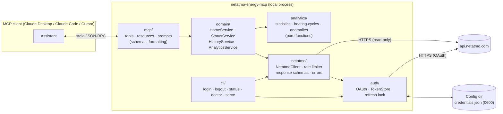
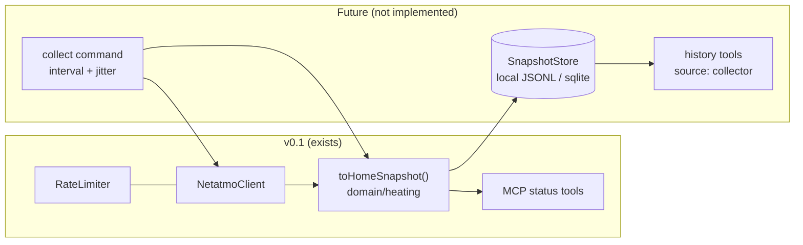

# Architecture

Status: accepted 2026-10-08. Sections are implemented phase by phase; see the README for current status.

## 1. Goals and non-goals

**Goals for v0.1**

- A local, read-only MCP server over **stdio** that gives AI assistants
  structured access to Netatmo Energy data (homes, rooms, devices,
  current status, history) plus deterministic heating analytics.
- Installable with `npx -y netatmo-energy-mcp`, authenticated with one
  `login` command, with no Docker, database, Python or LLM API key.
- A Netatmo client that is usable on its own, independent of MCP.

**Non-goals for v0.1**

- Any write operation (setpoints, modes, schedules).
- HTTP/SSE transport, remote hosting, multi-user deployment.
- Weather data, thermal modelling, predictions (see [roadmap](roadmap.md)).
- Energy or gas consumption figures, which the API does not provide.

## 2. Layered design



Dependencies only point downwards:

| Layer | Knows about | Must not know about |
|---|---|---|
| `mcp/` | domain services, Zod, MCP SDK | HTTP, tokens, Netatmo wire format |
| `domain/` | Netatmo client interface, analytics | MCP SDK |
| `analytics/` | plain data types | anything with I/O |
| `netatmo/` | `TokenProvider` interface, `fetch` | MCP, domain |
| `auth/` | filesystem, `fetch` | MCP, domain |
| `cli/` | everything (composition root) | — |

Wiring happens in one composition root (`src/app.ts`) with plain
constructor injection. There is no DI container.

## 3. Source layout

```
src/
  index.ts                 # bin entry: dispatch to CLI (default: serve)
  app.ts                   # composition root (builds services from config)
  cli/
    index.ts               # node:util parseArgs dispatcher
    commands/{login,logout,status,doctor,serve}.ts
  config/
    schema.ts              # Zod schema for env + file config
    loader.ts              # env > file > defaults; config-dir resolution
    paths.ts               # per-OS config directory
  auth/
    oauth.ts               # authorize URL, loopback callback server, code exchange
    token-store.ts         # atomic read/write, 0600, cross-process lock
    token-refresh.ts       # single-flight refresh, rotation handling
  netatmo/
    client.ts              # NetatmoClient (homesData, homeStatus, getRoomMeasure, getMeasure)
    endpoints.ts           # endpoint constants (read-only allow-list)
    schemas.ts             # Zod response schemas (lenient: passthrough + optional)
    types.ts
    errors.ts              # NetatmoError hierarchy + classification
    rate-limiter.ts        # sliding-window limiter (10 s + 1 h windows)
    measures.ts            # optimize=true segment decoding
  domain/
    homes/ rooms/ devices/ # topology normalisation, name resolution
    heating/               # current status
    history/               # range resolution, chunking, dedup, downsampling
    analytics/             # orchestrates analytics/ over fetched series
  analytics/
    statistics.ts heating-cycles.ts anomalies.ts
  mcp/
    server.ts              # createServer(services): McpServer
    tools/ resources/ prompts/
    errors.ts              # domain error → isError tool result
  utils/
    dates.ts               # tz-aware ISO formatting with Intl, period presets
    logger.ts              # stderr-only logger with secret redaction
tests/
  unit/ integration/ contract/ fixtures/
```

## 4. Runtime and dependencies

| Concern | Choice | Why |
|---|---|---|
| Runtime | Node.js ≥ 22.19 (CI: 22, 24) | Node 20 is EOL; vitest 5, tsdown and MCP Inspector v2 need ≥ 22 |
| Language | TypeScript 6.0 (strict), ESM | TS 7 not yet supported by typescript-eslint |
| MCP | `@modelcontextprotocol/server` 2.x (stable) | Current official SDK; the v1 line is in maintenance mode |
| Validation | `zod` 4.x | Required by SDK v2 (≥ 4.2) |
| HTTP | Native `fetch` + `AbortSignal` | No dependency |
| CLI parsing | `node:util` `parseArgs` | No dependency |
| Logging | Small in-house stderr logger | stdout is reserved for JSON-RPC |
| Build | tsdown | tsup is unmaintained and recommends tsdown |
| Tests | vitest 5 | |
| Lint/format | ESLint 10 + typescript-eslint, Prettier | |

**Runtime dependencies: two** (`@modelcontextprotocol/server`, `zod`).
See [ADR-0006](adr/0006-minimal-runtime-dependencies.md).

## 5. Authentication flow

```mermaid
sequenceDiagram
  participant U as User
  participant CLI as netatmo-energy-mcp login
  participant B as Browser
  participant N as Netatmo OAuth
  participant FS as credentials.json

  U->>CLI: login
  CLI->>CLI: state = random 256-bit; start 127.0.0.1 callback server
  CLI->>B: open authorize URL (scope=read_thermostat, state)
  B->>N: user signs in on netatmo.com and approves
  N->>B: 302 redirect_uri?code&state
  B->>CLI: GET /callback?code&state
  CLI->>CLI: constant-time state check; one-shot server closes
  CLI->>N: POST /oauth2/token (authorization_code + client_secret)
  N-->>CLI: access_token, refresh_token, expires_in
  CLI->>FS: atomic write (0600)
  CLI-->>U: "Logged in. Found 1 home, 7 rooms."
```

- The user's Netatmo password is only ever typed on netatmo.com.
- Fallback `login --manual`: the CLI prints the URL. The user pastes the
  final redirected URL back, and the CLI validates `state` the same way.
  This covers headless machines and cases where the loopback redirect
  is rejected.
- PKCE is **not** sent by default, because Netatmo does not document it.
  The client is confidential (it holds `client_secret`). See
  [ADR-0003](adr/0003-oauth-authorization-code-loopback.md).

### Token refresh

Several MCP server processes can run at once: one per client (Claude
Desktop, Cursor and Claude Code each spawn their own). Netatmo
invalidates the old refresh token immediately on rotation, so the refresh
procedure is:

1. Within a process, refreshes are single-flight: concurrent callers
   share one promise.
2. Across processes, the process acquires `credentials.lock` (exclusive
   create, stale after 30 s).
3. It re-reads `credentials.json`. If another process has already
   refreshed (newer `obtained_at` and the token is still valid), it uses
   that token and stops.
4. Otherwise it calls `POST /oauth2/token` with `grant_type=refresh_token`.
5. It writes the new pair atomically (temp file, then rename) and
   releases the lock.
6. On `invalid_grant` it raises `AuthRequiredError`: "Run
   `netatmo-energy-mcp login`."

Refresh is proactive (5 minutes before expiry) and reactive (on API
codes 2/3, with at most one retry).

## 6. Netatmo client

```ts
interface NetatmoClient {
  homesData(opts?: { homeId?: string; signal?: AbortSignal }): Promise<HomesData>;
  homeStatus(homeId: string, opts?: { signal?: AbortSignal }): Promise<HomeStatus>;
  getRoomMeasure(q: RoomMeasureQuery, opts?): Promise<MeasureSeries>;
  getMeasure(q: ModuleMeasureQuery, opts?): Promise<MeasureSeries>;
}
```

- **Read-only by construction.** `endpoints.ts` contains only the four
  read endpoints, and no code path can build another URL. A unit test
  asserts this.
- **Timeouts:** 15 s per request by default, merged with the caller's
  `AbortSignal`, which the MCP request signal is passed through to.
- **Retries:** reads only. Up to 3 attempts with exponential backoff and
  full jitter (base 500 ms, cap 8 s) on network errors, 5xx and 429.
  `Retry-After` is honoured up to 60 s; anything longer fails fast with
  `RateLimitError` and the wait time. There are no retries on 4xx other
  than 429 and auth codes 2/3.
- **Rate limiter:** sliding windows at 80 % of the documented per-user
  limits (40 requests per 10 s, 400 per hour), configurable. The
  per-app burst limit for single-user apps is uncertain (see
  [api-capabilities §7](api-capabilities.md#7-rate-limits)), so tune it
  after live testing.
- **Validation:** Zod schemas validate the fields we use. Unknown fields
  pass through. Missing optional fields become `null` with a note
  instead of failing. Spelling variants (`open_window`/`open_windows`,
  `rf_strength`/`rf_strenght`) are normalised.
- **Errors:**

  | Error | Raised for |
  |---|---|
  | `AuthRequiredError` | Not logged in, refresh token revoked, app deactivated |
  | `PermissionDeniedError` | Missing scope (code 13) |
  | `RateLimitError` | Rate limit hit; carries `retryAfterMs` |
  | `NotFoundError` | Device, home or room not found |
  | `InvalidRequestError` | Invalid arguments |
  | `NetatmoUnavailableError` | 5xx or network failure after retries |
  | `InvalidResponseError` | Schema mismatch |
  | `UnsupportedCapabilityError` | Data this installation can't provide, e.g. boiler history without a thermostat |

- **Caching:** an in-memory TTL cache with `homesdata` at 10 minutes,
  `homestatus` at 30 seconds, and measures over fully past windows at
  1 hour (bounded LRU). It saves rate-limit budget, which matters
  because assistants often call several tools in a row.

## 7. Historical data pipeline

```
resolve range ─▶ pick scale ─▶ plan chunks ─▶ fetch (sequential, limited)
     ─▶ decode segments ─▶ dedupe + sort ─▶ detect gaps ─▶ shape output
```

1. **Range:** either `period` (`today`, `yesterday`, `last_24h`,
   `last_7d`, `last_30d`), resolved in the **home's timezone**, or
   explicit ISO 8601 `from`/`to`. An input without an offset is read
   as home-local time. `to > from` is enforced, `to` is clamped to now,
   and the maximum span depends on scale.
2. **Scale:** `auto` picks the finest scale that keeps the
   point count ≤ 1024 for the whole range where possible (for example
   7 days gives `30min`, 90 days gives `3hours`, 1 year gives `1day`).
   An explicit scale is honoured.
3. **Chunks:** if the range exceeds 1024 points, it is split into windows
   of `1024 × step`, with a hard cap of 8 requests per tool call.
   Exceeding the cap returns a validation error that suggests a coarser
   scale. The server never silently truncates.
4. **Decode:** segments `{beg_time, step_time, value[][]}` are expanded
   to points; `optimize=false` is handled too.
5. **Dedupe** on timestamp (first wins), then sort ascending.
6. **Gaps:** any interval greater than 1.5 × step is reported as a gap.
   Values are **never interpolated**.
7. **Output modes** keep LLM context bounded:

   | `mode` | Returns | Size |
   |---|---|---|
   | `summary` | Statistics only | Constant |
   | `aggregated` (default) | Statistics plus the series downsampled to ≤ `max_points` buckets (min/mean/max per bucket) | ≤ 200 points by default |
   | `detailed` | Raw points | ≤ `max_points` (default 500, hard max 1000); `truncated: true` plus a hint if more exist |

   Original timestamps are preserved in `detailed` mode. Every
   response states `scale`, `real_time`, `timezone`, `coverage`
   (expected vs received points) and `gaps`.

## 8. Analytics (deterministic, no LLM)

These are pure functions over `{t, value}` series, with unit tests on
synthetic data.

| Metric | Definition | Source |
|---|---|---|
| min / max / mean / stddev | Over received points only | `temperature` |
| Time below / above target | Σ step where `temperature < sp_temperature − tolerance` (default 0.5 °C) and the reverse | `temperature` + `sp_temperature` (one request) |
| Boiler active duration | Σ `sum_boiler_on` (daily scales) or Σ `boileron × step/60 min` (sub-daily) | `getmeasure` |
| Room comparison | Per-room stats plus rankings (warmest, largest drop, most time below target) | rooms in parallel, within the rate budget |
| Largest drop | Max decrease over a sliding window (default 3 h) | `temperature` |

**Anomaly rules** (first version; thresholds are named constants that
can be overridden):

| Type | Rule (default) | Severity | Confidence |
|---|---|---|---|
| `impossible_jump` | \|Δ\| > 5 °C between consecutive 30-min points | high | medium |
| `out_of_range` | value < 0 °C or > 40 °C indoors | high | high |
| `flatline` | identical value for ≥ 12 h while the setpoint changed | medium | low |
| `missing_data` | gap > 3 × step | low–medium (by length) | high |
| `rapid_drop` | drop > 3 °C within 1 h while the setpoint was constant | medium | low |
| `sustained_below_setpoint` | ≥ 2 °C below setpoint for ≥ 3 h (mode ≠ off/hg) | medium | medium |
| `sustained_above_setpoint` | ≥ 3 °C above setpoint for ≥ 6 h | low | medium |

Each anomaly has the shape `{ type, severity, confidence, start, end,
room, evidence: [points], explanation }`. Explanations describe what was
observed ("temperature fell 3.4 °C in 50 min while the setpoint stayed
at 19 °C"), never a diagnosis ("your valve is broken" or "a window was
open").

## 9. MCP surface

### Tools (all `readOnlyHint: true`, `destructiveHint: false`, `openWorldHint: true`)

| Tool | Data source | Notes |
|---|---|---|
| `netatmo_list_homes` | homesdata | id, name, timezone, counts. No coordinates. |
| `netatmo_get_home` | homesdata | rooms, modules, therm mode, schedule names |
| `netatmo_list_rooms` | homesdata | id, name, type, module types |
| `netatmo_list_devices` | homesdata + homestatus | type, model name, room, battery, signal, reachable |
| `netatmo_get_home_status` | homestatus | all rooms: temp, setpoint, mode, demand; boiler status |
| `netatmo_get_room_status` | homestatus | temperature **and** setpoint for one room (by id or name) |
| `netatmo_get_heating_status` | homestatus | boiler on/off, per-room `heating_power_request`, anticipation, mode |
| `netatmo_get_device_status` | homestatus | firmware, battery, RF/Wi-Fi, reachability, boiler errors (OTH) |
| `netatmo_get_temperature_history` | getroommeasure | modes summary / aggregated / detailed |
| `netatmo_get_setpoint_history` | getroommeasure `sp_temperature` | |
| `netatmo_get_boiler_history` | getmeasure | `UnsupportedCapabilityError` if there is no NATherm1/OTM |
| `netatmo_get_heating_summary` | the above | per-period stats + time below/above target + boiler minutes |
| `netatmo_compare_rooms` | getroommeasure × rooms | rankings |
| `netatmo_detect_anomalies` | getroommeasure (+ setpoint) | rules in §8 |

**Differences from the brief (approved 2026-10-08):**

- **`netatmo_get_room_temperature` and `netatmo_get_room_setpoint` are
  merged** into `netatmo_get_room_status`. Both come from the same
  `homestatus` row. One tool keeps the tool list shorter, which improves
  model tool selection, and saves an API call when the user asks "is the
  bedroom at its target?"
- **`netatmo_get_heating_demand_history` is not registered.** Netatmo
  exposes `heating_power_request` only as a current value, so no
  history endpoint exists. Registering a tool that always fails wastes
  context and invites misuse. The current demand is in
  `netatmo_get_heating_status`, and the limitation is documented.

Common input conventions:
- `home_id` is optional when the account has a single home.
- Rooms can be given by `room_id` or `room_name` (case- and
  accent-insensitive match; ambiguity returns the candidates).
- Times are ISO 8601. Temperatures are in °C. Durations are in minutes.

Errors are returned as `isError: true` results with a stable `code`
(`AUTH_REQUIRED`, `RATE_LIMITED`, `NOT_FOUND`, `UNSUPPORTED_CAPABILITY`,
…), a human-readable message and a next step. Tokens and secrets never
appear in errors.

### Resources

| URI | Content |
|---|---|
| `netatmo://homes` | Home list |
| `netatmo://homes/{homeId}/rooms` | Rooms |
| `netatmo://homes/{homeId}/devices` | Devices |
| `netatmo://homes/{homeId}/status` | Current status |

Resources use `ResourceTemplate` with a `list` callback and return
`application/json`.

### Prompts

`heating_daily_report`, `heating_anomaly_review`, `room_comparison` and
`heating_efficiency_review`. Each prompt tells the assistant which tools
to call and requires the answer to separate **Observed data**,
**Derived metrics**, **Hypotheses** and **Recommendations**. Each one
also states that the data contains no gas or energy consumption.

## 10. Security model

| Threat / concern | Mitigation |
|---|---|
| Assistant changes heating | No write endpoints in code; `write_thermostat` never requested; test asserts the endpoint allow-list |
| Token leakage via logs | Logger redacts `access_token`, `refresh_token`, `client_secret`, `Authorization`, `code`; tokens never in error messages, tool output or `doctor` output (only "present, expires in 2 h 14 min") |
| Token leakage via filesystem | Per-user config dir, file mode `0600` (POSIX), directory `0700`; Windows relies on the user-profile ACL (documented) |
| Token corruption | Atomic write (temp + `rename`) and cross-process lock |
| OAuth CSRF / code injection | 256-bit random `state`, constant-time compare, one-shot callback, 5-min timeout, server bound to `127.0.0.1` only |
| Network exposure | stdio only; no listening socket except the short-lived loopback callback during `login` |
| PII exposure | `homesdata.user` (email) dropped; home coordinates/altitude not exposed; names (rooms, homes) are user data and are returned to the local assistant only |
| Supply chain | 2 runtime deps; lockfile; Dependabot; npm provenance via trusted publishing |
| Telemetry | None. Only `api.netatmo.com` is contacted. |
| Prompt injection via room names | Names are returned as data inside structured JSON; tools never execute anything based on returned content |

Note that any data returned to the assistant is processed by whatever
model the user's MCP client is configured with. The README states
this plainly.

## 11. Configuration

| Source | Precedence |
|---|---|
| CLI flags | highest |
| Environment (`NETATMO_CLIENT_ID`, `NETATMO_CLIENT_SECRET`, `NETATMO_REDIRECT_URI`, `NETATMO_MCP_CONFIG_DIR`, `NETATMO_MCP_LOG_LEVEL`) | |
| `credentials.json` (stores client id/secret and tokens after `login`) | |
| Defaults | lowest |

Config directory:

| OS | Location |
|---|---|
| Windows | `%APPDATA%\netatmo-energy-mcp` |
| macOS | `~/Library/Application Support/netatmo-energy-mcp` |
| Linux | `$XDG_CONFIG_HOME/netatmo-energy-mcp` (default `~/.config/netatmo-energy-mcp`) |

Because `login` stores the client credentials alongside the tokens, the
MCP client config needs no secrets: `{"command": "npx", "args": ["-y",
"netatmo-energy-mcp"]}`. See
[ADR-0004](adr/0004-bring-your-own-netatmo-app.md).

## 12. Testing strategy

| Layer | Tooling | Examples |
|---|---|---|
| Unit | vitest | state validation, token expiry math, rotation, error classification, chunk planning, segment decoding, dedup, tz formatting, statistics, boiler minutes, anomaly rules |
| Contract | vitest + sanitized fixtures | Zod schemas parse recorded-then-sanitized `homesdata` / `homestatus` / measure payloads, including spelling variants and missing fields |
| Integration | vitest + mocked `fetch` | client retries / 429 / `Retry-After`, refresh-on-401 with lock, history across chunk boundaries |
| MCP protocol | `InMemoryTransport` + `@modelcontextprotocol/client` | list tools/resources/prompts; call every tool; validate `structuredContent` against output schemas; error results |
| Smoke | MCP Inspector CLI against the built `dist/` with a fake API base URL | CI job |
| Live (opt-in) | `NETATMO_LIVE_TESTS=1` | read-only calls against the maintainer's account; never in CI; outputs never committed |

Fixtures are synthetic or sanitized: random IDs (`70:ee:50:00:00:01`),
generic room names, no coordinates, no emails.

## 13. Extension point: future snapshot collector (not in v0.1)

Netatmo provides no history for `heating_power_request` (room heating
demand) or `boiler_status`. The Thermal Twin project will need both. A
later release may add an **opt-in** collector that polls `homestatus`
and stores snapshots locally. v0.1 prepares for it but does not include
it ([ADR-0011](adr/0011-future-snapshot-collector.md)).



Seams that exist from v0.1 onward:

- **`HomeSnapshot`**: one normalised, timestamped type for current
  status. The MCP tools use it now, and a collector would persist it
  unchanged.
- **`NetatmoClient` + `RateLimiter`**: shared services. The rate
  budget is passed in as configuration, so a collector could run with
  its own smaller budget.
- **`Clock`**: injectable time source for scheduling and
  gap detection.

Collector requirements recorded for later:

- Configurable interval (default 5 min, minimum 2 min, with jitter)
- Local storage only
- Snapshots of heating demand, boiler status, room temperature and setpoint
- Missing-tick detection
- Rate-limit awareness
- Off by default
- Runs as a separate process (`netatmo-energy-mcp collect`), never
  inside the MCP server

Any series built from snapshots will always be labelled as locally
collected, never as Netatmo measurements.
